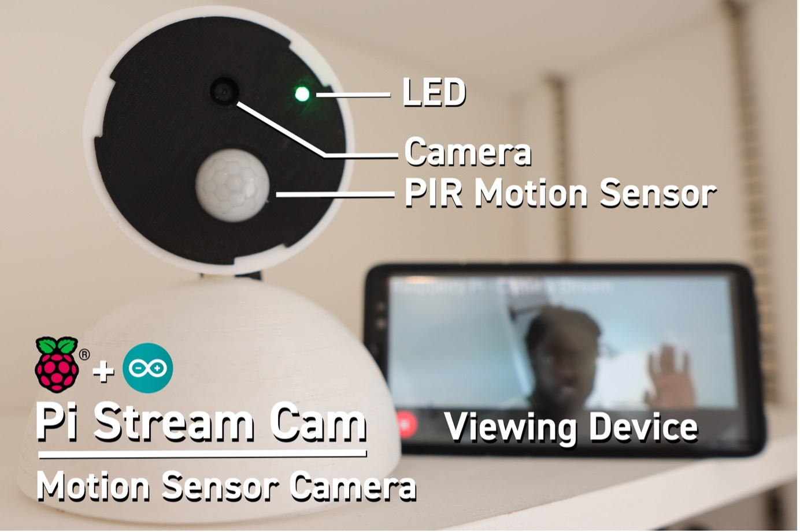
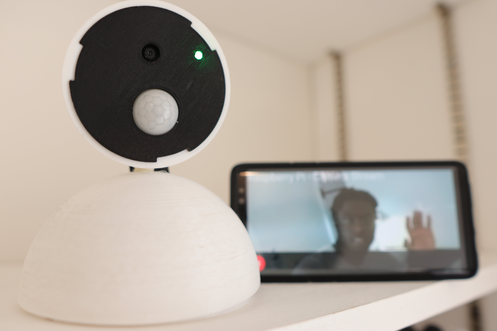
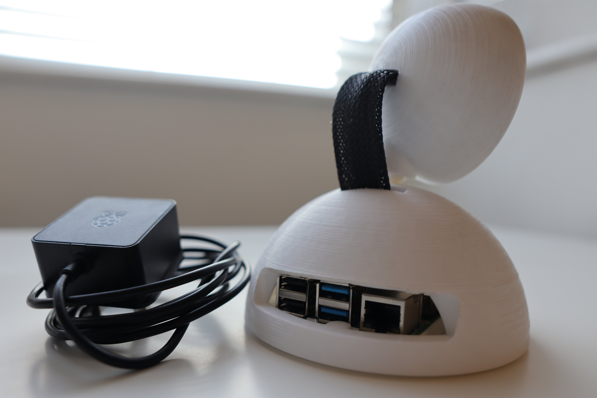
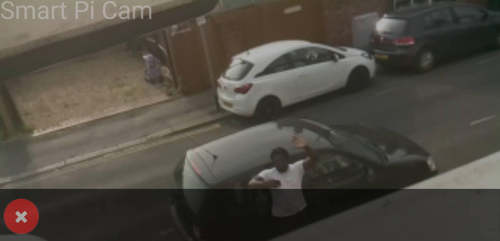
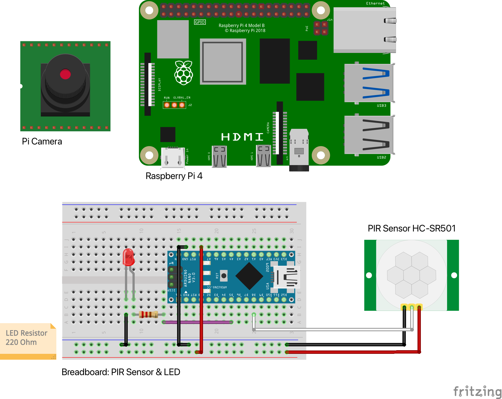
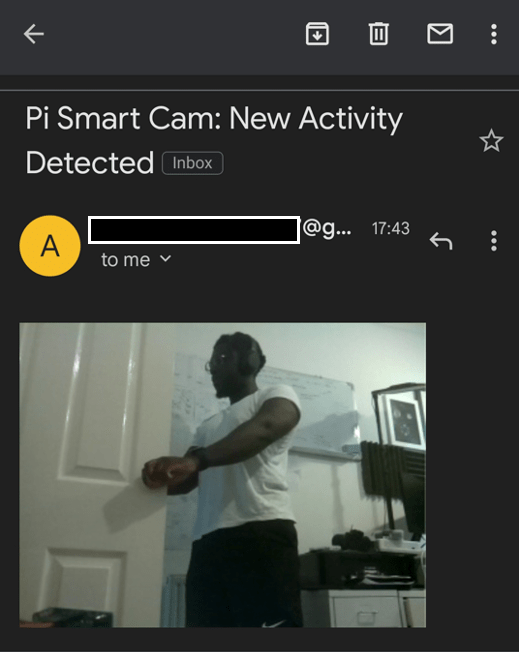

# Pi Smart Camera

The Pi Smart Cam is an open-source DIY Camera designed for you to view live footage from your phone or any device. The following features

Features:
-	PIR Sensor – For Motion Detection even in the Dark 
-	Message Notification – Receive an email on the latest Motion Detected
-	Web Application - Camera App Client

## Requirements:
- **This project builds on top of the [Pi Camera Stream Flask Repo](https://github.com/EbenKouao/pi-camera-stream-flask).** It's highly recommended to install and setup the following dependencies.

## Preconditions
* Raspberry Pi 4, 4GB+ is recommended for optimal performance. However you can use a Pi 3 or older, you may see a increase in latency.
* Raspberry Pi 4 Camera Module or Pi HQ Camera Module (Newer version) - USB Camera also Supported
* Python 3 recommended.


## Pi Smart Cam

 


 |  |  |
 | -------------------------------------------------------- | ----------------------------------------------------------- |
 | Pi Setup                                                 | Pi - Live Stream                                            |


Livestream Front Door

## Step 1 - Setup Pi Camera Stream



Run Camera with PIR Sensor: `python3 ~/pi-smart-cam/code/examples/pi-camera-stream-pir-sensor/main.py`

These Examples provide the building blocks to Build your own Pi Camera (Contribute to the Repo to build more examples!)
- pi-camera-stream-pir-sensor - Pi Camera Stream with PIR Sensor (and email notification)
- video-usb-enabled - Pi Camera Stream, additional USB enabled Camera Support


## Step 2 – PIR Wiring & Electronics
### Part List:

-	Pi Electronics:
    - Raspberry Pi 4 
    - Camera Module (HQ Pi Camera)

-	Arduino Electronics: Ring Bell and IR Sensor
    - PIR Sensor (HC-SR501)
    - Breadboard
    - Jumper Wires
    - Resistors: 330 Ohm 
    - Arduino Nano
    - LED
    - 220F Capacitor

## Step 3 - 3D Prints Assembly (Opional)

[.stl files for 3d Printing.](/3d-prints/)
Contribute your 3D Builds to the Repo.


## Step 4 – Activate Email Notification (Optional)



```
pi_email = "<from-email>"
pi_app_password = "<app-password>"
pi_port = 465
pi_host = "smtp.gmail.com"
notification_recipient = "<to-email>"
```

Note: If you use want to send email notifications via Gmail, enable 2FA and use App Passwords instead of storing the password as plain text. Consider using environment variables.

## Step 5 – Autostart your Pi Stream

Optional: A good idea is to make the the camera stream auto start at boot-up of your pi. You will now not need to re-run the script every time you want to create the stream. You can do this by going editing the /etc/profile to:

```
sudo nano /etc/profile
```

Go the end of the and add the following (from above):

```
python3 ~/pi-smart-cam/code/examples/pi-camera-stream-pir-sensor/main.py 
```

Configure your Pi to Boot in CLI (Run Pi Camera Stream on Boot-Up)

`sudo raspi-config` 

System Options -> Boot/ Auto Login -> Console AutoLogin -> Reboot


This would cause the following terminal command to auto-start each time the Raspberry Pi boots up. This in effect creates a headless setup - which would be accessed via SSH.
Note: make sure SSH is enabled.


